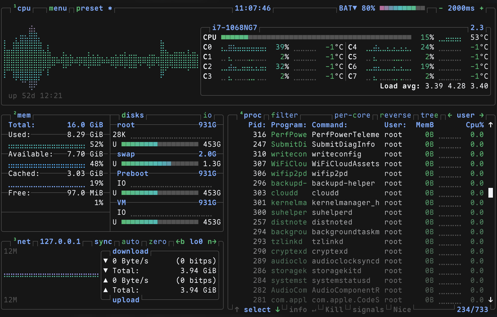

# nightfox-btop

[Nightfox](https://github.com/EdenEast/nightfox.nvim) color schemes for [btop](https://github.com/aristocratos/btop).

## Themes

| Theme | Background |
|-------|------------|
| nightfox | Dark, blue-tinted |
| dayfox | Light, warm |
| dawnfox | Light, rose-tinted |
| duskfox | Dark, purple-tinted |
| nordfox | Dark, nord-inspired |
| terafox | Dark, teal-tinted |
| carbonfox | Dark, IBM Carbon-inspired |

## Configuration

btop's config directory normally is at: `~/.config/btop/`,
so, the themes can be copied to: `~/.config/btop/themes/`:

```
.config/
└── btop
    └── themes
        ├── nightfox.theme
        ├── dayfox.theme
        ├── dawnfox.theme
        ├── duskfox.theme
        ├── nordfox.theme
        ├── terafox.theme
        └── carbonfox.theme
    btop.conf
```

In `btop.conf`, set the desired theme:

```
color_theme = "carbonfox"
```

## Preview

Carbonfox theme (Recommended):



The themes use the official Nightfox color palettes with:
- Green → Yellow → Red gradients for CPU/temperature meters
- Blue → Purple → Red gradients for download graphs
- Green → Yellow → Orange gradients for upload graphs

## Credits

- [Nightfox.nvim](https://github.com/EdenEast/nightfox.nvim) by EdenEast
- [btop](https://github.com/aristocratos/btop) by aristocratos
